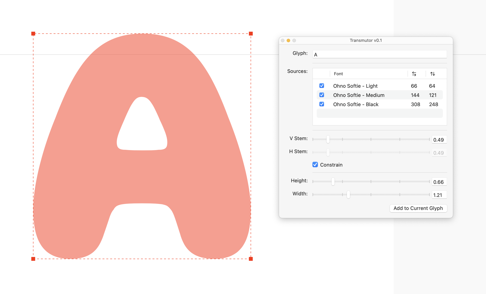

# Transmutor
_Scale and Transform glyphs in the RoboFont glyph window using MutatorScale_

__By Colin M. Ford and OH no Type Co.__

[ScaleFast](https://github.com/roboDocs/ScaleFast) a fantastic extension for RoboFont. You should use it! It's really great at scaling whole swaths of glyphs while keeping the stem weights consistent — the perfect tool for small caps or fraction figures. But sometimes you just want to use ScaleFast on one or two glyphs, and for small jobs that it's like using a flamethrower to light a candle. That's where Transmutor comes in.

Transmutor uses ScaleFast's underlying scaling-interpolating library called [MutatorScale](https://github.com/roboDocs/MutatorScale) (which, in turn, is built upon the OG interpolation library, [MutatorMath](https://github.com/LettError/MutatorMath) by [Erik van Blokland](https://github.com/letterror/)). It allows you to _transform_ and interpolate _("Mutate")_ glyphs in the glyph window, hence Trans-Mutator.

It goes beyond just scaling glyphs in a few seconds to make those annoying backlot glyphs like `™` Trademark and `®` Registered. We all know that in type design, glyphs are often based on other glyphs. Transmutor can help you turn two `O`'s into an `8`, for instance, or squeeze a `W` into a `₩`. The possibilities are endless! (Well, not really, but it's still pretty cool.)

## Installation
- Download the latest release from the [Releases](https://github.com/ohnotypeco/Transmutor-Ext/releases) page. OR
- Install by cloning this repo. Make sure to install submodules, see [Contributing](#contributing).

- Double-click the `.roboFontExt` file to install.
- Not yet available on Mechanic!

## Usage

### Tool Window
1. Type your glyph name into this field here. The glyph needs to exist in all your sources. Speaking of which...
2. Here are all the open fonts. Check the boxes next to the fonts you want to use as sources.
3. Control the stem weights of the glyph. By default, the stem weights are interpolated together (Isotropic interpolation). Uncheck the `Constrain` box to allow the stem weights to be controlled independently (Anisotropic interpolation). Helpful when you're dealing with heavy weights.
4. These control the height and width of the glyph. You can use these, but it's better to use your mouse here.

### Mouse Controls
- **Click and drag** to scale the glyph.
- **Shift + click and drag** to scale the glyph while constraining the proportions.
- **Option + click and drag horizontally** to interpolate the stem weight uniformly (Isotropic interpolation).
- **Shift + Option + click and drag horizontally/vertically** to interpolate the glyph's vertical and horizontal stems independently (Anisotropic interpolation).

## Acknowledgements
- A huuuuuuuuuuge thank you to [Loïc Sander](https://github.com/loicsander) for making [ScaleFast](https://github.com/roboDocs/ScaleFast) and [MutatorScale](https://github.com/roboDocs/MutatorScale). These tools have made type design so much easier for me and so many others.
- [Erik van Blokland](https://github.com/letterror/) for [MutatorMath](https://github.com/LettError/MutatorMath), and Skateboard, which inspired some of the controls for Transmutor.
- [Frederik Berlaen](https://github.com/typemytype/) and [Tal Leming](https://github.com/typesupply/) for RoboFont, EZUI, and Merz, and for their help in understanding those amazing tools.
- [Ryan Bugden](https://github.com/ryanbugden) and [Connor Davenport](https://github.com/connordavenport) for responding to all my Discord questions so quickly!

## Contributing
- If you have any questions, comments, or suggestions, please [open an issue](https://github.com/ohnotypeco/Transmutor-Ext/issues). 
- Please note if you are cloning this repo, there is a submodule for MutatorScale, see [Working with Submodules](https://github.blog/2016-02-01-working-with-submodules/). When pulling changes, you may need to run `git submodule update --init --recursive` to get the latest version of MutatorScale.

